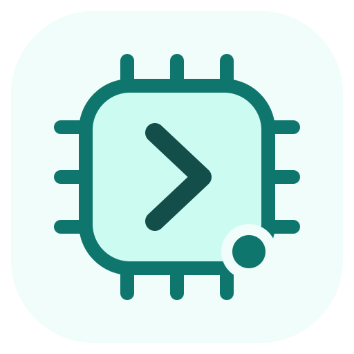

# AutoDL Direct

<picture>
  <source media="(prefers-color-scheme: dark)" srcset="plugins/autodl-direct/assets/logo-dark.svg">
  
</picture>

本地运行的 Codex 插件，直接调用 AutoDL 官方 API 管理 Pro 实例，配合系统 SSH 完成远程任务。当前为 **Windows 预览版 0.1.2**，由此私有仓库分发，采用 MIT 许可证。

这是独立开发的非官方集成，与 AutoDL、OpenAI 无隶属或合作关系。已验证本机加密凭据读取和真实账户只读余额查询；实例管理、GPU 操作和 SSH 任务尚未实测。详细结果见 [验证记录](plugins/autodl-direct/VERIFICATION.md)。

## 安装

需要 Node.js 22 及以上、支持 `codex plugin` 的 Codex，以及 Windows PowerShell。SSH 工作流需要系统 OpenSSH 和可用的 SSH 密钥或别名。

使用有权访问此私有仓库的 GitHub 账号登录并克隆，然后安装：

```powershell
gh auth login
gh repo clone Puiching-Memory/autodl-direct
Set-Location autodl-direct
powershell.exe -NoProfile -ExecutionPolicy Bypass -File .\plugins\autodl-direct\scripts\Install-Plugin.ps1
```

已登录时跳过第一步。安装脚本只注册本地目录和安装插件。也可在仓库根目录手动执行：

```powershell
codex plugin marketplace add .
codex plugin add autodl-direct@autodl-tools
```

保留本地克隆目录。更新时使用 `git pull`，再运行安装脚本。GitHub 仓库权限与 AutoDL 凭据分别配置。

在本机终端配置 Token：

```powershell
powershell.exe -NoProfile -ExecutionPolicy Bypass -File .\plugins\autodl-direct\scripts\Configure-Token.ps1
```

输入隐藏；脚本只读查询余额验证 Token，然后通过 Windows DPAPI 加密保存到当前用户的 `%LOCALAPPDATA%\CodexAutoDL\token.dpapi`。不要向聊天提供 Token，也不要提交到 Git。已有凭据无需重复配置。

配置后在新聊天中说：“使用 AutoDL Direct 检查配置，查询我的余额和 Pro 实例。”

## 功能与边界

共 10 个 MCP 工具：查询配置、余额、Pro 实例、SSH 地址及私有镜像；预览或执行创建、GPU 模式开机、关机和保存系统盘镜像。变更默认只预览，`execute=true` 才发送真实请求。详见 [工具说明](plugins/autodl-direct/README.md)。

Skill 引导使用系统 SSH、SCP/SFTP 上传代码、后台运行任务、检查日志和取回结果。API 仅管理 Pro；普通实例可使用已有 SSH 工作流。未包含实例释放、企业弹性部署、自动关机调度、创建前报价或预算上限。API 接受请求不代表操作完成；开机命令失败不会自动关机。

## 复查和开发

AutoDL 业务代码由本项目编写，未使用社区 AutoDL 项目的代码。协议层使用 MCP 官方 SDK，参数校验使用 Zod。运行产物已附在 `dist/`，安装使用无需下载 npm 依赖。第三方版本及许可见 [依赖说明](plugins/autodl-direct/THIRD_PARTY_NOTICES.txt)。

仅在重新构建或测试时需要开发依赖：

```powershell
npm.cmd ci --prefix plugins/autodl-direct/tooling --ignore-scripts --no-audit --no-fund
node plugins/autodl-direct/tooling/build.mjs
node --test plugins/autodl-direct/tooling/verify.test.mjs
```

测试使用模拟请求及固定的无效凭据，不读取实际 Token。CI 不注入 AutoDL 凭据，不执行 GPU 操作。

目录清单位于 `.agents/plugins/marketplace.json`，插件位于 `plugins/autodl-direct/`。版本变化见 [CHANGELOG](CHANGELOG.md)，凭据和问题报告说明见 [SECURITY](SECURITY.md)。

业务代码和自制图标采用 [MIT](LICENSE)；第三方代码保留各自许可证。许可证不代表 AutoDL 或 OpenAI 的授权、背书或支持。

- [AutoDL 通用 API](https://www.autodl.com/docs/common_api/)
- [AutoDL Pro API](https://www.autodl.com/docs/instance_pro_api/)
- [Codex 插件与目录格式](https://developers.openai.com/plugins/build/plugins)
- [MCP 官方 SDK](https://github.com/modelcontextprotocol/typescript-sdk)
